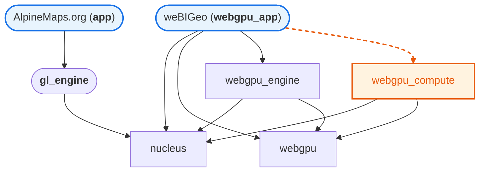

#  AlpineMaps.org

   

This is a mono-repository containing the [AlpineMaps.org](https://alpinemaps.org) and [weBIGeo](https://webigeo.alpinemaps.org/) projects alongside their shared dependencies. Both are under active development and aim to provide state-of-the-art real-time rendering and processing for large-scale, tile-based geodata.

[If looking at the issues, best to filter out projects!](https://github.com/AlpineMapsOrg/renderer/issues?q=is%3Aissue%20state%3Aopen%20no%3Aproject)

We are in discord, talk to us!
https://discord.gg/p8T9XzVwRa

## Applications

###  [AlpineMaps.org (`app`)](docs/app.md)
Qt Quick / OpenGL frontend, the original alpinemaps.org client.

###  [weBIGeo (`webgpu_app`)](docs/webgpu-app.md)
WebGPU rendering engine with ImGui UI and GPU compute graph.

## Architecture

- `nucleus` — shared core: tile management, camera, data structures
- `webgpu` — base WebGPU wrapper (device, pipelines, buffers)
- `gl_engine` — OpenGL rendering engine (used by the QML app)
- `webgpu_engine` — terrain rendering pipeline on top of `nucleus`/`webgpu`
- `webgpu_compute` — GPU compute nodes (avalanche, snow, trajectories); optional, enabled via `ALP_WEBGPU_APP_ENABLE_COMPUTE`

## Code style
* class names are CamelCase, method, function and variable names are snake_case.
* class attributes have an m_ prefix and are usually private, struct attributes don't and are usually public.
* "use `void set_attribute(int value)` and `int attribute() const` for setters and getters (that is, avoid the get_)." Use Qt recommendations for naming boolean getters.
* structs are usually small, simple, and have no or only few methods. they never have inheritance.
* files are CamelCase if the content is a CamelCase class. otherwise they are snake_case, and have a snake_case namespace with stuff.
* the folder/structure.h is reflected in namespace folder::structure{ .. }
* indent with space only, indent 4 spaces
* ideally, use the clang-format file provided with the project
  (in case you use Qt Creator, go to Preferences -> C++ -> Code Style: Formatting mode: Full, Format while typing, Format edited code on file save, don't override formatting)
* follow the Qt recommendations and the C++ core guidelines everywhere else.

## Developer workflow
* Fork this repository.
* Enable github pages from actions (Repository Settings -> Pages -> Source -> GitHub Actions)
* Work in branches or your main.
* Make pull requests from your main branch.
* Github Actions will run the unit tests and create packages for the browser and Android and deploy them to your_username.github.io/your_clone_name/.
* Make sure that the unit tests run through.
* We will also look at the browser version during the pull request.
* Ideally you'll also setup the signing keys for Android packages.
