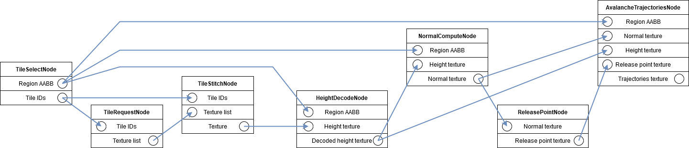

# Technical Documentation

## Project Structure

The project is organized into different components using CMake. For each component, there is a directory containing source files as well as a CMake file, that defines a CMake target for that component. Dependencies between components are reflected in dependencies between their respective CMake targets.

- **`nucleus`**, a library containing lots of basic functionality such as the camera, tiles loading, GPX track loading or converting between coordinate spaces. This is used by most other CMake targets.
- **`webgpu`**, a library that provides general purpose abstractions for WebGPU concepts, such as buffers, textures and pipelines.
- **`webgpu_app`**, an executable that serves as the entry point the webigeo application. It mainly contains window management, input handling and UI rendering and uses `webgpu_engine` for rending the scene.
- **`webgpu_engine`**, a library that contains the implmementation of the renderer using WebGPU (utilizing the abstractions from the `webgpu` target). Also provides a graph-based workflow framework, which we use to run our GPU avalanche simulations.
- **`unittests`** contains unit tests written using the Catch2 testing framework

The project root directory contains the main CMake file. It defines a set of options, that can be used to customize which targets to build as well as enable or disable specific webigeo or AlpineMaps features.

### Available CMake flags

TODO

## Pipelines

Our application contains two different kinds of pipelines. The **rendering pipeline** is the sequence of steps needed to produce a view of the scene with the current camera configuration, shading and effects. The **compute pipeline** is the sequence of steps that are performed to calculate the avalanche simulation. The target `webgpu_engine` contains both, the rendering as well as the compute pipeline.

### Rendering pipeline

Our rendering pipeline is a WebGPU port of the AlpineMaps OpenGL/WebGL deferred renderer, with minor changes. Here is a brief overview of how the rendering pipeline.

#### Atmosphere pass
The atmosphere pass takes the camera configuration and renders the color of the atmosphere into a texture. The texture is a single pixel wide and as high as the viewport.

#### Geometry pass
The geometry pass takes the camera configuration, an array of height map textures and ortho photo textures and renders the scene. However, each aspect of the scenes is rendered into a different texture and no shading is applied yet. 

- _albedo texture_: color of the terrain
- _position texture_: world position for each pixel
- _normal texture_: surface normals
- _render overlay texture_: color, based on some metric (e.g. zoom level)

#### Compose pass
The compose pass takes in the output texture of the atmosphere pass, the output textures of the geometry pass and a number of parameters for configuring shading, effects and overlay blending.

Optionally, another texture can be passed, the _compute overlay texture_. If present, also a rectangular section of the terrain needs to be specified by passing the regions minimum and maximum world coordinates. The texture is then blended on top of the terrain within that specific region of the map. This is used to display the results of our compute pipeline, i.e. the avalanche simulation results. 

### Compute pipeline
We provide a framework for specifying arbitrary workflows as graphs (in code). Each graph consists of a set of nodes. Each node has inputs and outputs (input/output sockets) with specific data types. Outputs of one node can be connected to inputs of another of the same data type.

To implement specific transformations of a set of inputs to a set of outputs, the abstract base class for nodes `webgpu_engine::compute::nodes::Node` has to be extended. The class `webgpu_engine::compute::nodes::NodeGraph` serves as a container for nodes, resolves dependecies between them and runs them in the correct order.

We utilize this system to implement a pipeline for computing avalanche trajectories within a region, using the height map of that region as input.

#### Avalanche trajectories pipeline
Our use case to help assess the avalanche danger within a specified (rectangular) region. To that end, we simulate multiple avalanches and overlay their paths on top of the 3D terrain.

To achieve this, we implemented a set of nodes and connect them to define a node graph. The final output of the graph should be a texture that contains all avalanche paths.

We implemented the following nodes:

- **`TileSelectNode`**: Outputs a list of tile IDs and the axis-aligned bounding box (AABB) of a specific region (AABB of the GPX track that was uploaded most recently).
- **`TileRequestNode`**: Requests the tile data from a specific tile server. The tile server can be specified as part of the node settings. Outputs a list of textures.
- **`TileStitchNode`**: Merges together a list of textures with corresponding tile ids into a single texture. The merging is performed by reserving the output texture on the GPU and then copying the per-tile textures into it at the correct positions.
- **`HeightDecodeNode`**: Converts the heights from the format provided by the tile server into a float representing the actual height in meters in parallel using compute shaders. Also corrects scale according to the map projection.
- **`NormalComputeNode`**: Takes a region AABB and a height texture and calculates normals for the surface defined by the height texture. Done in parallel using compute shaders.
- **`ReleasePointNode`**: From a normal texture, calculates positions where avalanches might start. Currently, this only involves checking if the slope angle is within a specific range. Done in parallel using compute shaders.
- **`AvalancheTrajectoriesNode`**: Using region AABB, normal texture, height texture and release point texture, simulates avalanches using a Monte-Carlo approach. This approach allows us to simulate many different trajectories in parallel on the GPU using compute shaders and paint their path into the output texture.

These nodes are composed in a node graph as can be seen in the following figure. 

After the pipeline was executed, the trajectories texture is used as _compute overlay texture_ in the rendering pipeline and thus blended at the correct region of the terrain.   
