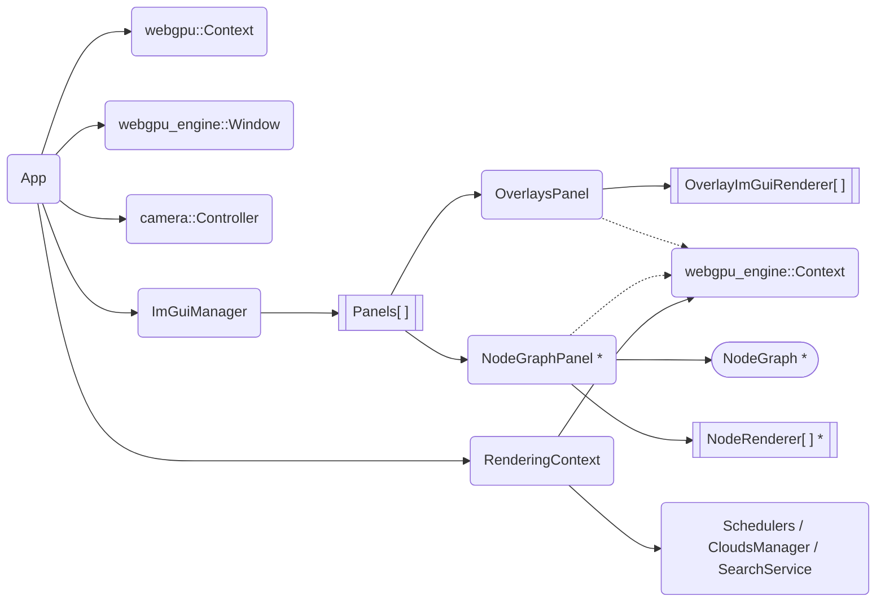

#  webgpu_app - Developer Guide

## Application structure

`apps/webgpu_app/main.cpp` creates the `webgpu_app::App`, which owns the SDL window, the WebGPU device, and the render loop (`App.cpp`). Each frame:

1. `ImGuiManager::render()` records the ImGui draw commands for the UI on top of the scene.
2. The 3D scene (terrain, overlays) is rendered via `webgpu_engine` only on demand (e.g. on camera change).

*Solid arrows = ownership (`unique_ptr`/value). Dashed arrows = non-owning reference. 
\* only compiled when `ALP_WEBGPU_APP_ENABLE_COMPUTE` is enabled.*

### ImGuiManager

`ImGuiManager` (`apps/webgpu_app/ImGuiManager (.h/.cpp)`) is tying the UI together:
- Initializes the Dear ImGui / ImNodes contexts and fonts.
- Owns the list of `ImGuiPanel`s and draws them every frame.
- Forwards SDL events to ImGui

### Panels

All panels implement the `ImGuiPanel` interface (`apps/webgpu_app/ui/ImGuiPanel.h`) with three optional overrides:

| Method | When called | Purpose |
|---|---|---|
| `ready()` | once after init | deferred setup (e.g. connect signals) |
| `draw_panel()` | every frame, inside the sidebar `Begin`/`End` block | sidebar content |
| `draw()` | every frame, outside the sidebar | floating windows, overlays |

In general we follow a feature-based directory layout - each feature folder owns its panel (e.g. `overlay/OverlaysPanel`, `compute/NodeGraphPanel`). General-purpose panels live in `apps/webgpu_app/ui/`. New panels must be manually instantiated and registered in `ImGuiManager` (`apps/webgpu_app/ImGuiManager.cpp`).

### OverlayImGuiRenderer

`OverlaysPanel` is the ImGui panel used to configure which overlays are active and their settings - the actual rendering is done by the corresponding `webgpu_engine::OverlayRenderer`. Each overlay type can have a matching `OverlayImGuiRenderer` subclass (`apps/webgpu_app/overlay/`) that draws its settings controls, with two overridable methods:

| Method | Purpose |
|---|---|
| `display_name()` | label shown in the overlay list |
| `render_custom_settings()` | overlay-specific ImGui controls; return `true` if a redraw is needed |

If no specific subclass is registered, the base `OverlayImGuiRenderer` serves as a fallback.

> [!IMPORTANT]
> After adding a new Overlay to the engine you have to:
> - **`OverlaysPanel.cpp`**: extend the `AddType` enum and `ADD_ITEMS[]` array and add a branch in `add_overlay_of_type()` to instantiate the new type.
>
> **and optionally**
> - **UI renderer**: create a matching `OverlayImGuiRenderer` subclass in `apps/webgpu_app/overlay/`
> - **`OverlayImGuiRendererFactory.cpp`**: add a `dynamic_cast` branch in `OverlayImGuiRendererFactory::create()`

### Compute

The `NodeGraphPanel` (`apps/webgpu_app/compute/`) manages the active `NodeGraph` and owns one `NodeRenderer` per node instance, providing the visual/interactive representation in the node-graph editor. Nodes can route their output to overlays via `OverlayRenderNode`.

Each node type can have a matching `NodeRenderer` subclass (`apps/webgpu_app/compute/nodes/`) with the following overridable methods:

| Method | Purpose |
|---|---|
| `has_settings()` | return `true` to enable the settings panel for this node |
| `render_settings_content()` | draw node-specific ImGui settings controls |
| `render_dialogs()` | called outside `BeginNodeEditor`/`EndNodeEditor` for correct z-ordering (e.g. file dialogs) |
| `serialize_ui()` / `deserialize_ui()` | persist UI-layer state |

`NodeRendererFactory::create()` maps compute node types to their renderer via `dynamic_cast`. If no specific subclass is registered, the base `NodeRenderer` is used as a fallback (renders the node with sockets but no settings panel).

> [!IMPORTANT]
> When adding a new compute node type, three files must be touched:
> 1. **Compute node** — create a `Node` subclass in `webgpu/compute/nodes/` (the engine-side compute logic).
> 2. **Node registry** — call `register_node()` in `NodeRegistry::NodeRegistry()` (`webgpu/compute/NodeRegistry.cpp`) so the node can be instantiated by name (required for graph serialization / the add-node dialog).
> 3. **UI renderer** — optionally create a `NodeRenderer` subclass in `apps/webgpu_app/compute/nodes/` and add a `dynamic_cast` branch in `NodeRendererFactory::create()` (`apps/webgpu_app/compute/nodes/NodeRendererFactory.cpp`).

#### OverlayRenderNode

`OverlayRenderNode` (`apps/webgpu_app/compute/OverlayRenderNode.h`) is a special sink node that bridges the compute graph and the rendering system. Unlike regular compute nodes it lives in the app layer because it holds a reference to `webgpu_engine::Context`. When executed, it forwards the graph's output texture to a `TextureOverlay` managed by the engine's `OverlayRenderer`, making compute results visible in the 3D viewport.
