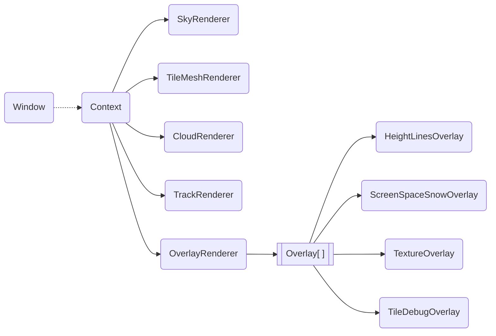
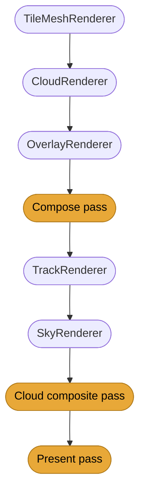

# webgpu_engine - Rendering Pipeline

## Overview

`webgpu_engine` implements the 3D rendering pipeline for the terrain viewer. It builds on top of [webgpu_base](webgpu_base.md) for shader preprocessing, GPU resource management, and RAII wrappers. The central ownership structure is `webgpu_engine::Context`, which holds all renderers as `std::shared_ptr`. `webgpu_engine::Window` acts as the glue layer that drives the per-frame render sequence by calling into Context in a fixed order.

*Solid arrows denote ownership. The dashed arrow from Window to Context is a non-owning reference -> Window receives Context via `set_context()` but does not own the renderers.*

## Render sequence

`Window::paint()` drives the frame in this fixed order:

<table>
<tr>
<td width="30%" valign="top">

</td>
<td width="70%" valign="top">

`TileMeshRenderer` renders the visible terrain tiles into the G-buffer (albedo/position/normal/overlay + depth).

`CloudRenderer` draws volumetric clouds into an offscreen target; only runs when `m_clouds_enabled`.

`OverlayRenderer` draws the pre-/post-shading overlay textures (height lines, snow, etc.) that Compose blends in.

`Compose pass` *(`Window`-owned)* resolves the G-buffer into the scene-color target -> blending in the overlay pre-/post-shading textures and terrain lighting/atmosphere transmittance along the way.

`TrackRenderer` renders GPX tracks directly into the scene-color target; only runs when tracks exist and `m_track_render_mode > 0`. Must happen before Sky so track lines get layered under atmospheric aerial perspective.

`SkyRenderer` layers the physically-based atmosphere (LUT sky-view, aerial perspective) over the scene-color back buffer; skipped when `m_sky_enabled` is false, in which case later stages read the scene-color target directly.

`Cloud composite pass` *(`Window`-owned)* blends the volumetric cloud result on top of whichever background (sky or scene color) is active; only runs when clouds are enabled.

`Present pass` *(`Window`-owned)* blits the final result (one of four permutations of sky/no-sky × clouds/no-clouds) to the swapchain.

</td>
</tr>
</table>

## Renderers

A **Renderer** represents a self-contained stage of the rendering pipeline. It may own geometry, textures, compute pipelines, or multi-pass algorithms. Renderers write to shared G-buffer slots or intermediate render targets that later stages read from.

Current renderers and their responsibilities:

| Class | Location | Role |
|-------|----------|------|
| `SkyRenderer` | `webgpu/engine/sky/` | Physically-based atmosphere/sky (LUT scattering, aerial perspective), layered over the scene color target |
| `TileMeshRenderer` | `webgpu/engine/tile_mesh/` | Terrain tiles with height maps and orthophoto textures |
| `CloudRenderer` | `webgpu/engine/cloud/` | Volumetric clouds |
| `TrackRenderer` | `webgpu/engine/track/` | GPX tracks |
| `OverlayRenderer` | `webgpu/engine/overlay/` | Orchestrates overlay compositing (see below) |

Context exposes a typed setter for each renderer (`set_tile_mesh_renderer()`, etc.) so the app layer can inject or replace implementations at startup.

## Overlays

An **Overlay** is a purely screen-space effect layered on top of the rendered geometry. It does **not** draw geometry or manage 3D state. It reads the current colour/depth buffer and writes a modified version.

> [!WARNING]
> The ping-pong contract requires every overlay stage to write **every pixel** of `target_output`. Leaving pixels unwritten produces undefined results because the output texture is not cleared between stages.
>
> Overlay stages should be implemented as **compute pipelines** wherever possible. A traditional render pipeline is only acceptable when a compute path is not feasible (e.g. `TextureOverlay` uses a render pipeline for hardware blending).

The `OverlayRenderer` owns the list of active `Overlay` instances and sorts them by `z_index` before compositing:

- **`z_index < 0`**: pre-shading - composited before lighting/atmosphere affects the image.
- **`z_index >= 0`**: post-shading - composited after the full scene is lit.

Current overlay implementations:

| Class | Location | Effect |
|-------|----------|--------|
| `HeightLinesOverlay` | `webgpu/engine/overlay/` | Contour lines derived from depth buffer |
| `ScreenSpaceSnowOverlay` | `webgpu/engine/overlay/` | Snow accumulation on flat surfaces in screen space |
| `TextureOverlay` | `webgpu/engine/overlay/` | Overlays Rasterdata when provided appropriate AABB data |
| `TileDebugOverlay` | `webgpu/engine/overlay/` | Debug visualisation for gbuffer |

> [!NOTE]
> When adding a new **Overlay**, register it via `OverlayRenderer::add_overlay()` and optionally create a matching `OverlayImGuiRenderer` subclass in `apps/webgpu_app/overlay/` for settings UI (see [webgpu_app_dev.md](webgpu_app_dev.md#overlayimguirenderer)).
>
> When adding a new **Renderer**, add a typed accessor and setter to `webgpu_engine::Context`, instantiate it in `RenderingContext::initialize()` (`apps/webgpu_app/RenderingContext.cpp`), and call it from `Window::paint()` at the appropriate step.
